     

# All-In-One Home Server Automation
Here you'll find automation from the baremetal proxmox install to the Kubernetes ConfigMaps.

## Goal
To automate the installation and configuration of my home infrastructure. This is a complete solution, from a blank bare metal state to a fully function Proxmox install including self hosted GitHub Actions runners, Kubernetes clusters, routers and more. The only manual step is plugging the two USB drives into the target server.
## Components
- [Auto-Install](https://github.com/tekore/HomeOps/tree/main/Auto-Install)
- [Ansible](https://github.com/tekore/Ansible)
- [Terraform](https://github.com/tekore/Proxmox)
- [Kubernetes](https://github.com/tekore/Kubernetes)
## Automation Overview

```mermaid
flowchart TD
    Boot["🔌 Server Boot via USB"] --> Proxmox["💾 Proxmox Installation"]
    Proxmox --> FirstBoot["🚀 Firstboot Script"]
    FirstBoot --> GithubVM["🖥️ GitHub Actions VM Installed"]
    GithubVM --> PullPlaybook["📥 Actions VM Pulls Playbook"]
    PullPlaybook --> ActionsContainer["🐳 Actions Container Installed"]
    ActionsContainer --> SelfRegister["📝 Container Self-Registers"]
    SelfRegister --> Pipeline["⚙️ Pipeline Triggered"]
    Pipeline --> Terraform["🏗️ Terraform Build"]
    Terraform --> AnsiblePull["🔄 All VMs Ansible Pull"]
    AnsiblePull --> Kubectl["☸️ Apply the Kustomize YAML"]
    %% Styling
    style Boot fill:#d5e8d4,stroke:#82b366,color:#333
    style Proxmox fill:#dae8fc,stroke:#6c8ebf,color:#333
    style FirstBoot fill:#dae8fc,stroke:#6c8ebf,color:#333
    style GithubVM fill:#dae8fc,stroke:#6c8ebf,color:#333
    style PullPlaybook fill:#dae8fc,stroke:#6c8ebf,color:#333
    style ActionsContainer fill:#dae8fc,stroke:#6c8ebf,color:#333
    style SelfRegister fill:#dae8fc,stroke:#6c8ebf,color:#333
    style Pipeline fill:#dae8fc,stroke:#6c8ebf,color:#333
    style Terraform fill:#dae8fc,stroke:#6c8ebf,color:#333
    style AnsiblePull fill:#ffe6cc,stroke:#d79b00,color:#333
    style Kubectl fill:#ffe6cc,stroke:#82b366,color:#333
```

## Maintainers
[@Tekore](https://github.com/tekore)
